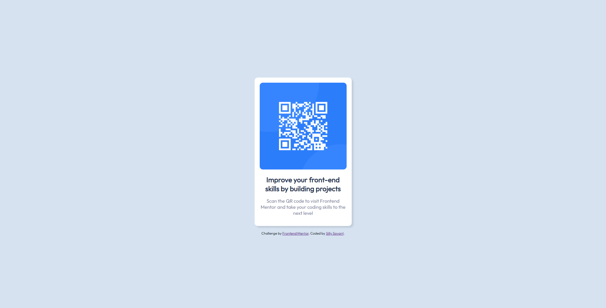

# Frontend Mentor - QR code component solution

This is a solution to the [QR code component challenge on Frontend Mentor](https://www.frontendmentor.io/challenges/qr-code-component-iux_sIO_H). Frontend Mentor challenges help you improve your coding skills by building realistic projects. 

## Table of contents

- [Overview](#overview)
  - [Screenshot](#screenshot)
  - [Links](#links)
- [My process](#my-process)
  - [Built with](#built-with)
  - [What I learned](#what-i-learned)
  - [Continued development](#continued-development)
  - [Useful resources](#useful-resources)
- [Author](#author)
- [Acknowledgments](#acknowledgments)

## Overview

### Screenshot



### Links

- Solution URL:(https://github.com/sillysavant/QR-Code-Challenge)
- Live Site URL:(https://sillysavant.github.io/QR-Code-Challenge/)

## My process

### Built with

- Semantic HTML5 markup
- CSS custom properties
- Flexbox

### What I learned

Applying the knowledge I've learned to making this was hard as I don't know explicitly how to go from scratch, so all I could've done was trial and fail. Besides, getting the right measures for each component was also challenging.
I feel like there's still a lot more for me to learn.

```html
<body>
  <div class="card">
    

    <h1>Improve your front-end skills by building projects</h1>
    <p>Scan the QR code to visit Frontend Mentor and take your coding skills to the next level</p>
  </div>

  <footer>
    <div class="attribution">
      Challenge by <a href="https://www.frontendmentor.io?ref=challenge" target="_blank">Frontend Mentor</a>. 
      Coded by <a href="https://github.com/sillysavant">Silly Savant</a>.
    </div>
  </footer>
</body>
```
```css
body{
    background-color: hsl(212, 45%, 89%);
    font-size: 15px;
    font-family: "Outfit", serif;
    display: flex;
    flex-direction: column;
    align-items: center;
    justify-content: center;
    height: 100vh;
}
```

### Continued development

These challenges are great for someone who wants to try out their newly-consumed knowledge of front-end development, so I'll continue to engage in these. 

### Useful resources

- [The Net Ninja](https://www.youtube.com/c/TheNetNinja) - Great youtube channel with inspiring lessons

## Author
- Frontend Mentor - [@sillysavant](https://www.frontendmentor.io/profile/sillysavant)

## Acknowledgments
It first got really hard so I kinda checked out a few solutions. Then I see it's not that hard.